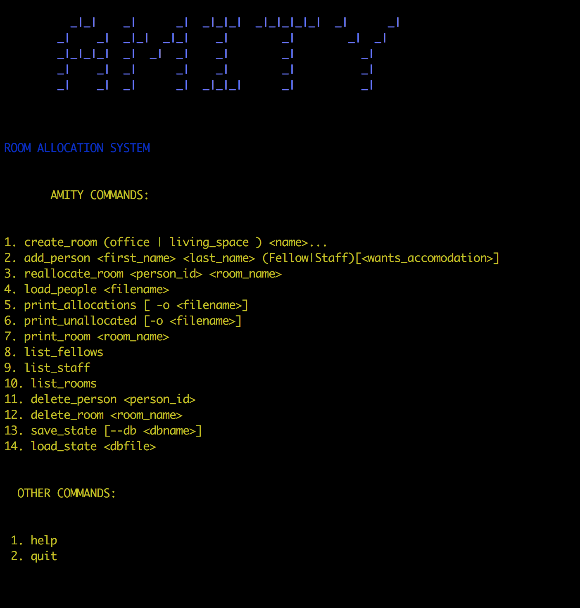

[](https://travis-ci.org/NgangaMaryanne/Amity-maryanne)
[](https://coveralls.io/github/NgangaMaryanne/Amity-maryanne?branch=develop)
# AMITY-MARYANNE 
Amity is a room allocation system for one of Andela's facilities. 
The system allows you to create rooms in Amity, Add people to Amity, allocate the added people to rooms in Amity. 
Amity rooms could be offices or living spaces. 
Every member of Amity can get an office. A fellow can decide whether they want a living space but 
a member of staff cannot get a living space. 
## INSTALLATION
* Clone repository

   ```git@github.com:NgangaMaryanne/Amity-maryanne.git```

* Create Virtual Environment
You will need to have virtualenvwrapper installed. 
Run command:
```mkvirtualenv Amity```
```workon Amity```
* Install requirements

  ```pip install -r requirements.txt```
* Run the amity script on interactive terminal.
  * Open your terminal 
  * Enter command:
  
  ```python run.py -i```
* Interact with Amity by issuing Amity commands discussed below.

## AMITY COMMANDS.
Upon running the `python run.py -i` command, the screen below appears.
It contains all Amity commands and the arguments required by each command.


## SAMPLE USAGE
Watch video below for a clearer picture of interacting with Amity.

<a href="https://asciinema.org/a/78537s65q8zulfy2asm8qah6e" target="_blank"></a>